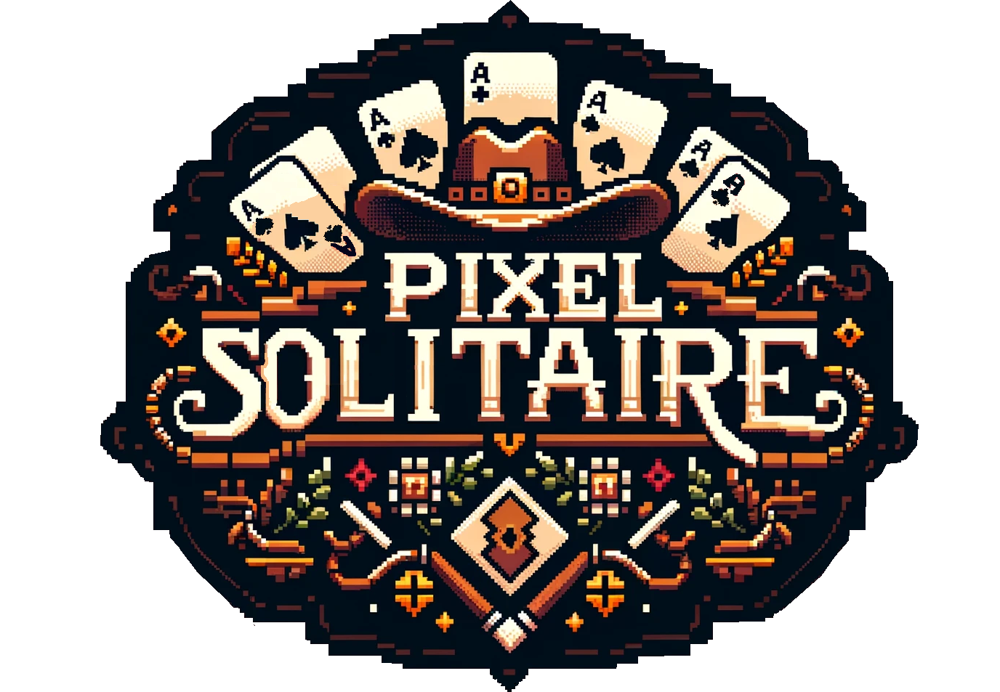

<!-- Improved compatibility of back to top link: See: https://github.com/othneildrew/Best-README-Template/pull/73 -->
<a id="readme-top"></a>
<!--
*** Thanks for checking out the Best-README-Template. If you have a suggestion
*** that would make this better, please fork the repo and create a pull request
*** or simply open an issue with the tag "enhancement".
*** Don't forget to give the project a star!
*** Thanks again! Now go create something AMAZING! :D
-->


<!-- PROJECT SHIELDS -->
<!--
*** I'm using markdown "reference style" links for readability.
*** Reference links are enclosed in brackets [ ] instead of parentheses ( ).
*** See the bottom of this document for the declaration of the reference variables
*** for contributors-url, forks-url, etc. This is an optional, concise syntax you may use.
*** https://www.markdownguide.org/basic-syntax/#reference-style-links
-->
<!-- [![Contributors][contributors-shield]][contributors-url]
[![Forks][forks-shield]][forks-url]
[![Stargazers][stars-shield]][stars-url]
[![Issues][issues-shield]][issues-url]
[![project_license][license-shield]][license-url]
[![LinkedIn][linkedin-shield]][linkedin-url]
-->


<!-- PROJECT LOGO -->
<br />
<div align="center">
  <a href="https://github.com/github_username/repo_name">
    
  </a>

<h3 align="center">Pixel Solitaire</h3>

  <p align="center">
    Klondike game created using the LibGDX Java framework.
    <br />
    <a href="https://github.com/github_username/repo_name"><strong>Explore the docs »</strong></a>
    <br />
    <br />
    <a href="https://github.com/github_username/repo_name">View Demo</a>
    ·
    <a href="https://github.com/github_username/repo_name/issues/new?labels=bug&template=bug-report---.md">Report Bug</a>
    ·
    <a href="https://github.com/github_username/repo_name/issues/new?labels=enhancement&template=feature-request---.md">Request Feature</a>
  </p>
</div>


<!-- TABLE OF CONTENTS -->
<details>
  <summary>Table of Contents</summary>
  <ol>
    <li>
      <a href="#about-the-project">About The Project</a>
      <ul>
        <li><a href="#built-with">Built With</a></li>
      </ul>
    </li>
    <li>
      <a href="#getting-started">Getting Started</a>
      <ul>
        <li><a href="#prerequisites">Prerequisites</a></li>
        <li><a href="#installation">Installation</a></li>
      </ul>
    </li>
    <li><a href="#usage">Usage</a></li>
    <li><a href="#roadmap">Roadmap</a></li>
    <li><a href="#contributing">Contributing</a></li>
    <li><a href="#license">License</a></li>
    <li><a href="#contact">Contact</a></li>
    <li><a href="#acknowledgments">Acknowledgments</a></li>
  </ol>
</details>


<!-- ABOUT THE PROJECT -->
## About The Project

[![Product Name Screen Shot][product-screenshot]](https://example.com)

My Grandfather has always been a massive fan of Solitaire. As a kid growing up I spent most of my summers with him, and nearly every night he would sit at the kitchen table playing round after round with his old card deck he had since his Air Force days. As a gift to him, and a challenge to myself, I wanted to create a desktop version of the game that he would be able to easily install and play on his Windows machine, and thus PixelSolitaire was born. Rather than use a simplified game engine such as Unity or Godot, I wanted to write as much of the game myself as I could in a feasible timeframe. I settled on using LibGDX, which is a basic game framework written in Java and has a small but dedicated userbase. 

<p align="right">(<a href="#readme-top">back to top</a>)</p>


### Built With

* [![Java][java]][java-url]
* [![LibGDX][libgdx]][libgdx-url]
* [![Aseprite][aseprite]][aseprite-url]
* [![AndroidStudio][androidStudio]][androidStudio-url]

<p align="right">(<a href="#readme-top">back to top</a>)</p>


<!-- GETTING STARTED -->
## Getting Started

PixelSolitaire has been packaged as a .exe file using Gradle and Construo for simple launch on Windows, or alternatively the game can be launched from the Java files directly. 

### .exe Launch

To get started quickly on Windows, the dsitribution zip file [can be downloaded from Google Drive.](https://drive.google.com/file/d/1BRWi_-KUecY2GWI8tY7hVlsn7TspRgCW/view?usp=drive_link)  Once downloaded, extract the folder and open the file named "PixelSolitaireREDUX-1.0.0" and the game should launch.


### Installation

1. If you do not already have Java installed on your machine, download a recent version from https://www.java.com/en/
2. If you do not already have Gradle installed on your machine (standard with most Java IDEs), download a recent version from https://gradle.org/install/
2. Clone the repo
   ```sh
   git clone https://github.com/jwbmarten/PixelSolitaireREDUX.git
   ```
3. Navigate to the desktop launcher class below and run it
   ```sh
   PixelSolitaireREDUX/lwjgl3/src/main/java/com/pixel/game/lwjgl3/Lwjgl3Launcher.java
   ```


<p align="right">(<a href="#readme-top">back to top</a>)</p>


<!-- USAGE EXAMPLES -->
## Project & Game Logic

### LibGDX 

This game was created using LibGDX, which is a Java-based game framework (NOT an engine!) that contains tools and libraries for graphics rendering, input handling, and audio/visual asset management. At its core, LibGDX program life cycles consist of 3 steps:
1. Create: this is called when the program is first executed, and creates the initial state of the game, loads assets, and performs any general housekeeping the developer may specify.
2. Update: updates the game state according to game logic such as applying physics to objects, checking if win conditions are met, etc.
3. Render: Draw images/graphics to the screen.

Step 1 is run only once when the game is first launched, and then steps 2 and 3 are run repeatedly at a frequency determined by the user's machine (effectively being the frame rate).

### Game Logic - Set Up

The bulk of the game logic can be found in the Java class: 
   ```sh
   PixelSolitaireREDUX/core/src/main/java/com/pixel/gameStates/Klondike.java
   ```

The game setup is performed in the Klondike constructor method - which primarily handles loading assets, setting the camera and viewport, and dictating graphical settings such as card spacing - and the initializeGame() method - which creates a deck, shuffles it, and deals the starting cards to the Tableau. The deck is generated by creating 52 Card objects, one of each rank for each suit.

   ```sh
   PixelSolitaireREDUX/core/src/main/java/com/pixel/game/Card.java
   ```

 You will notice the Tableau, Foundation, and draw/discard piles have different data structures (stacks v ArrayLists) which as you will see later is done to simplify rendering logic while also optimizing runtime performance. Lastly, you will also notice an object is created at startup called "Hand" - the hand serves a few purposes, such as representing the user's current cursor postion, holding information such as if there is an actively held card, what that card is (and any cards above it if a stack is being held), holding card positions in case they need to be restored, etc.

   ```sh
   PixelSolitaireREDUX/core/src/main/java/com/pixel/game/Hand.java
   ```


### Game Logic - Interactivity

To properly emulate the classic desktop Solitaire experience, it is important to give users a high degree of freedom and account for many different scenarios. In all cases, however, user interactivity is done with a mouse click, mouse click-release, or mouse movement. LibGDX provides an interface for handling inputs named InputProcessor, and you can view the implementation I have created in the Java class below: 

   ```sh
   PixelSolitaireREDUX/core/src/main/java/com/pixel/game/SolitaireInputProcessor.java
   ```

You will notice in the SolitaireInputProcessor constructor, I have given it an argument of "State." This State is actually the Klondike.java class we have been discussing, and by providing it to the input processor, information such as cursor position, card positions, camera projection, and more can be passed back and forth.

There are 4 primary inputs handled in the SolitaireInputProcessor class, they are:
1. touchDown: this is called when a mouse click is registered. It takes the X-Y position of the click and then sends it to the Klondike state instance and performs the method checkIfCardClicked. It also changes the state of the cursor hand from open to closed.
2. touchUp: this is called with a mouse click is released. It takes the X-Y position of the current mouse position and sends it to the Klondike state instance to check if a valid placement has been performed. If a valid placement is performed, then it will be executed in the Klondike instance and then the method is complete, otherwise a series of operations are called to return the active card(s) to the original state and postion before the user grabbed and dragged the card(s).
3. touchDragged: this is called when the user moves the cursor with an active mouse click. First it updates the position of the hand object so it will be rendered in the correct position in the next cycle, then if it has an active card, it will update the position of that card (and any on top of it if moving a stack) so that it too will be rendered in the right position in the next cycle. 
4. mouseMoved: this is called when the user moves the cursor without an active mouse click. It will update the position of the hand object for rendering, but it will also check if the menu is active, and if the menu is active if any buttons are being hovered which will require a hover response. 

In the Klondike class, the two methods referenced above - checkIfCardClicked and checkIfCardPlaced - do a lot of the heavy lifting when it comes to interaction logic. 

checkIfCardClicked takes a given X-Y position (which is provided by SolitaireInputProcessor) and systematically checks each object that may be clicked to see if the X-Y position in within their bounds. Note this checks not only cards as the method name might suggest, but also buttons such as the menu and undo buttons. You will also notice that there is an added complexity when clicking a card in the tableau. Since a user is allowed to move multiple face up cards at once, we need to handle not only the card which was clicked, but any cards stacked on top of the active card. These cards and their positions are stored in the Hand object.

checkIfCardPlaced does not take any arguments directly, but is called when touchUp is executed if there is an active card and will return a boolean indicating if there was a successful placement. The logic is broken out depending on what card "type" (i.e. a tableau card, a foundation card, or a card from the draw pile) the active card type is. The active card will be checked against the card the cursor is hovering over. If no card is being hovered, then the method will return false to indicate an unsuccessful placement. If there is a card being hovered, then another method will be called (checkCardCanBePlaced) which will determine if the action is valid. Valid conditions will be different if placing a card in the tableau vs the foundation, so you will notice there are two further methods which are called depending on action type. If all checks come back valid, then the card position(s) are updated, the card objects are moved to the corresponding data structures, and then the method returns true - otherwise the method returns false and the cards are returned to their original position. 

### Game Logic - Undo

One of the most popular features of desktop solitaire is the undo function. To implement this functionality, a stack of object type "gameSnapshot" is maintained to track move history. When cards are successfuly moved, a snapshot of the draw deck, waste pile, foundation, and tableau is taken and stored as a "gameSnapshot" object and pushed into the stack. When the undo button is pushed, the previous game state is popped from the stack and implemented. 

### Game Logic - Winning

At each update cycle, the win condition is checked. The win condition simply checks if each foundation pile has a size of 12 cards, and if so returns true or otherwise false. If the win condition is met, the update method will set the boolean "gameIsWon" to true which will trigger the winning animation to be displayed. The animation will run in a loop until the game is exited or a new game is started.


### Rendering

The rendering logic can be found in the Klondike class, in the aptly named render method. Objects are rendered in the order they are drawn, so if card B is drawn after card A, if will be superimposed over it in the area they overlap. The order of operations then are broken down as follows:
1. Draw the background (green felt)
2. Draw the options & undo buttons
3. Draw a card back if draw pile is not empty, or an empty slot indicator if empty
4. Draw the waste pile from left to right if not empty
5. Draw the top card in each foundation pile if not empty, or an empty slot indicator if empty
6. Draw each column in the tableau from bottom to top if not empty 
7. Draw the active card(s) if any - note they must be removed from the tableau or foundation data structures when becoming active otherwise they will render out of order and possibly be placed underneath other cards when being dragged. 
8. If game has been won, draw the win animation
9. If menu has been pressed, draw the menu
10. Draw the hand object

### Options Menu

The option menu allows the user additional actions that cannot be accessed from the main play "scene." In order to launch the option menu, the user should click the option button in the corner. Doing so changes the boolean "optionsPressed" to true, which in turn will render the menu images, and allow menu buttons to be clicked. This is handled in the render and checkIfCardClicked methods. From the options menu, the user is also able to toggle on and off the music and SFX, start a new game, exit the game, or return to the main menu (still in progress) The large menu buttons will also change to be colored if the user hovers over them, which is handled in the SolitaireInputProcessor class in the mouseMoved method. 

### Music & SFX

LibGDX has built in methods for handling music and sfx files. I have stored royalty free music and sfx .mp3 files in the asset folders which are loaded in the Klondike constructor method. The music is started at the onset of the game, and sfx files are played when certain actions are performed (e.g. a card is clicked, or a card is successfully placed.) These can be toggled on and off from the options menu.


<p align="right">(<a href="#readme-top">back to top</a>)</p>

<!-- ACKNOWLEDGMENTS -->
## Acknowledgments

* [Card art adapted from Kenney free game assets](https://kenney.nl/assets)
* [Peacefully - Benjamin Coultier](https://www.bensound.com/)

<p align="right">(<a href="#readme-top">back to top</a>)</p>


<!-- MARKDOWN LINKS & IMAGES -->
<!-- https://www.markdownguide.org/basic-syntax/#reference-style-links -->
[libgdx]: https://img.shields.io/badge/LibGDX-e74a45?style=for-the-badge&logo=youtubegaming&logoColor=000000
[libgdx-url]:https://libgdx.com/
[java]: https://img.shields.io/badge/JAVA-cornflowerblue?style=for-the-badge&logo=coffeescript&logoColor=
[java-url]: https://www.java.com/en/
[aseprite]: https://img.shields.io/badge/aseprite-7B68EE?style=for-the-badge&logo=aseprite&logoColor=FFFFF0
[aseprite-url]: https://www.aseprite.org/
[contributors-shield]: https://img.shields.io/github/contributors/github_username/repo_name.svg?style=for-the-badge
[androidStudio]: https://img.shields.io/badge/Android%20Studio-3DDC84?style=for-the-badge&logo=android-studio&logoColor=white
[androidStudio-url]: https://developer.android.com/studio
[contributors-url]: https://github.com/github_username/repo_name/graphs/contributors
[forks-shield]: https://img.shields.io/github/forks/github_username/repo_name.svg?style=for-the-badge
[forks-url]: https://github.com/github_username/repo_name/network/members
[stars-shield]: https://img.shields.io/github/stars/github_username/repo_name.svg?style=for-the-badge
[stars-url]: https://github.com/github_username/repo_name/stargazers
[issues-shield]: https://img.shields.io/github/issues/github_username/repo_name.svg?style=for-the-badge
[issues-url]: https://github.com/github_username/repo_name/issues
[license-shield]: https://img.shields.io/github/license/github_username/repo_name.svg?style=for-the-badge
[license-url]: https://github.com/github_username/repo_name/blob/master/LICENSE.txt
[linkedin-shield]: https://img.shields.io/badge/-LinkedIn-black.svg?style=for-the-badge&logo=linkedin&colorB=555
[linkedin-url]: https://linkedin.com/in/linkedin_username
[product-screenshot]: images/screenshot.png
[Next.js]: https://img.shields.io/badge/next.js-000000?style=for-the-badge&logo=nextdotjs&logoColor=white
[Next-url]: https://nextjs.org/
[React.js]: https://img.shields.io/badge/React-20232A?style=for-the-badge&logo=react&logoColor=61DAFB
[React-url]: https://reactjs.org/
[Vue.js]: https://img.shields.io/badge/Vue.js-35495E?style=for-the-badge&logo=vuedotjs&logoColor=4FC08D
[Vue-url]: https://vuejs.org/
[Angular.io]: https://img.shields.io/badge/Angular-DD0031?style=for-the-badge&logo=angular&logoColor=white
[Angular-url]: https://angular.io/
[Svelte.dev]: https://img.shields.io/badge/Svelte-4A4A55?style=for-the-badge&logo=svelte&logoColor=FF3E00
[Svelte-url]: https://svelte.dev/
[Laravel.com]: https://img.shields.io/badge/Laravel-FF2D20?style=for-the-badge&logo=laravel&logoColor=white
[Laravel-url]: https://laravel.com
[Bootstrap.com]: https://img.shields.io/badge/Bootstrap-563D7C?style=for-the-badge&logo=bootstrap&logoColor=white
[Bootstrap-url]: https://getbootstrap.com
[JQuery.com]: https://img.shields.io/badge/jQuery-0769AD?style=for-the-badge&logo=jquery&logoColor=white
[JQuery-url]: https://jquery.com 
